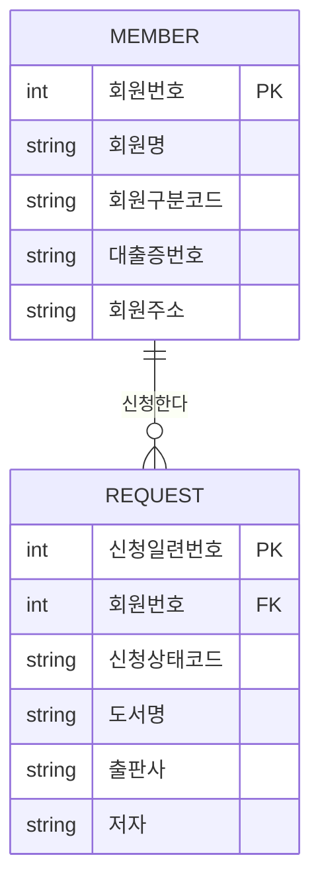

## ERD(Entity Relationship Diagram) 작성 순서

### 1. 엔티티(Entity)를 도출한다.
- 업무에서 관리해야 할 대상을 찾는다.
- 명사 형태로 표현하는 경우가 많다.

**예시**
- 회원
- 도서
- 주문
- 상품

---

### 2. 도출된 엔티티를 적절하게 배치한다.
- 중요한 엔티티를 **왼쪽 상단**에 배치한다.
- 관련 있는 엔티티끼리 가깝게 배치한다.
- 관계선이 최대한 겹치지 않도록 한다.

```text
회원 ───── 주문
 │          │
 │          │
 상품 ─── 주문상세
```

---

### 3. 엔티티 간의 관계를 정의한다.
- 엔티티끼리 어떤 연관이 있는지 연결한다.

**예시**
- 회원 ↔ 주문
- 주문 ↔ 주문상세
- 상품 ↔ 주문상세

---

### 4. 관계명을 기술한다.
관계를 **동사** 형태로 작성한다.

| 엔티티 | 관계명 |
|---------|---------|
| 회원 → 주문 | 주문한다 |
| 학생 → 강의 | 수강한다 |
| 교수 → 강의 | 강의한다 |

관계는 크게 두 가지가 있다.

- **행위 관계**
  - 주문한다
  - 신청한다
  - 수강한다

- **존재 관계**
  - 소속된다
  - 포함된다
  - 관리된다

---

### 5. 관계의 참여도(Cardinality)를 기술한다.
관계에 참여하는 개수를 표현한다.

| 관계 | 의미 |
|------|------|
| 1 : 1 | 일대일 |
| 1 : N | 일대다 |
| M : N | 다대다 |

예시

회원(1) ─── 주문(N)

→ 회원 한 명은 여러 건의 주문을 할 수 있다.

---

### 6. 관계의 필수/선택 여부(Optionality)를 기술한다.
NULL 허용 여부를 의미한다.

| 표기 | 의미 |
|------|------|
| ○ | 선택(Optional, 0) |
| │ | 필수(Mandatory, 1) |
| 까치발 | 다수(Many) |

예시

```text
회원 │────────○<
     1       0..N
희망도서신청
```

의미

- 회원은 희망도서를 **0건 이상** 신청할 수 있다.
- 희망도서신청은 **반드시 회원 1명**에 의해 신청된다.

---

## 작성 순서 요약

1. 엔티티를 찾는다.
2. 엔티티를 배치한다.
3. 엔티티 간 관계를 연결한다.
4. 관계명을 작성한다.
5. 참여도(1:1, 1:N, M:N)를 표시한다.
6. 필수/선택 여부를 표시한다.
